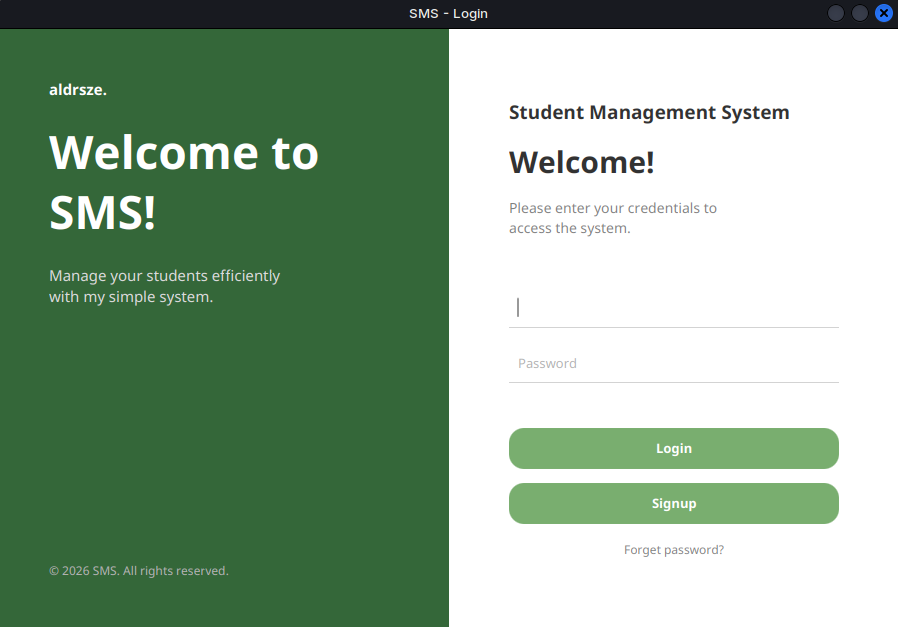
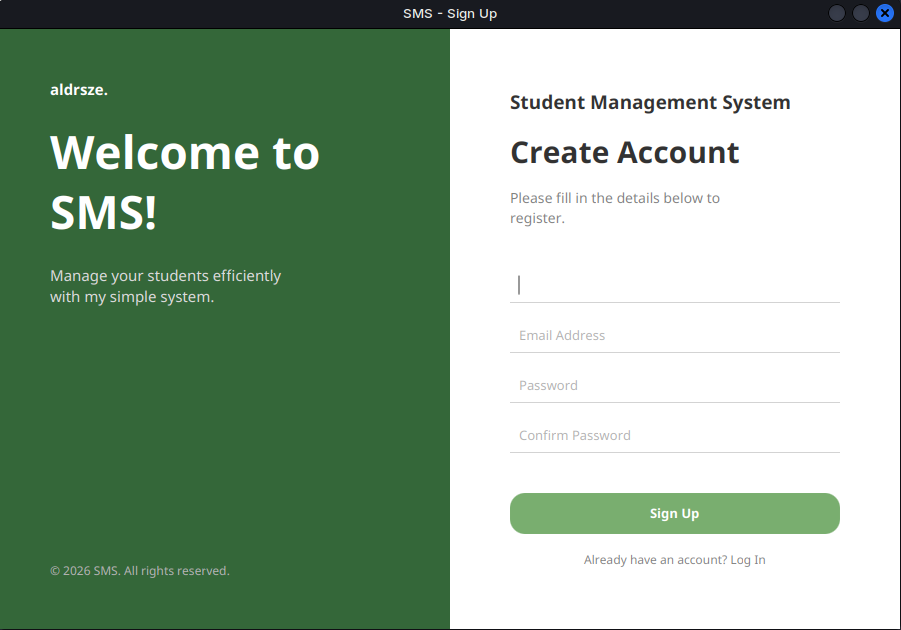
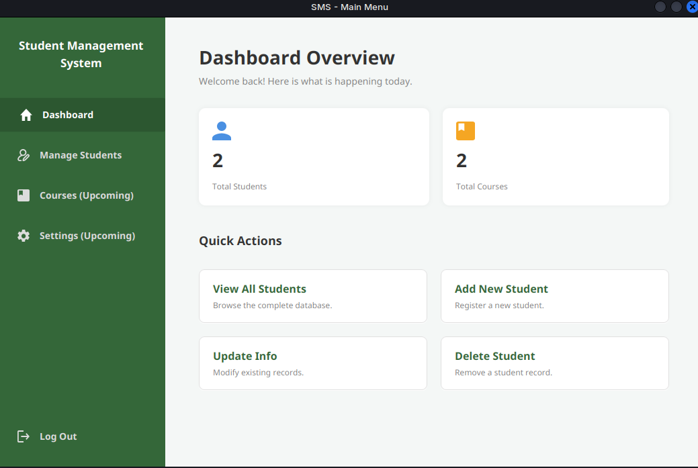
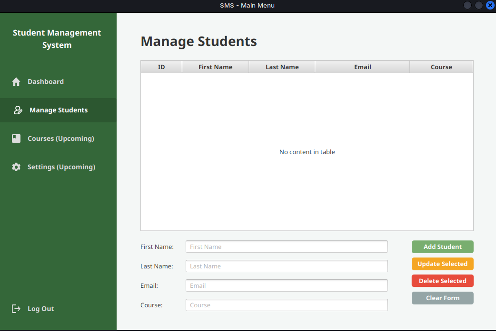

#  Student Management System

Java student management app with GUI (JavaFX) and CLI interfaces. Includes user auth and CRUD operations.

## OVERVIEW

### GUI Interface






## Quick Start

**Prerequisites:** JDK 8+, MySQL, Maven

**Setup:**
```bash
mysql -u root -p < setup.sql
mvn clean install
./run-sms.sh        # Linux/Mac
run-sms.bat         # Windows
```

**Login:** admin / 123456

## Tech Stack
Java | JavaFX | MySQL | Maven | DAO/MVC

##
## aldrsze.